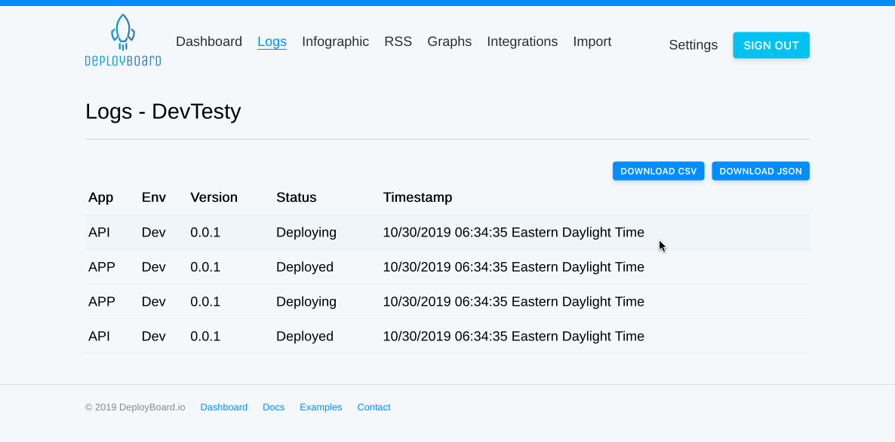

# Usage

The most universal way to post your deployment events to DeployBoard is using curl. You will need to retrieve your API Key from the Settings page to make requests to DeployBoard.

## Curl

You can put a message to the /put api endpoint. You will need to pass your API key as the `X-API-Key` header.

###### GET

If you are using the GET method, you will need to pass your data into the url as query string parameters.

```
curl -H "X-API-Key: your_api_key" "https://api.deployboard.io/put?app=APP&env=Prod&version=1.0.0&status=Deploying"
curl -H "X-API-Key: your_api_key" "https://api.deployboard.io/put?app=APP&env=Prod&version=1.0.0&status=Deployed"
```

###### POST

If you are using the POST method, you will need to pass your data in as JSON.

```
DATA='{"app": "APP", "env": "Dev", "version": "1.0.0", "status": "Deploying" }'
curl -X POST -H "X-API-Key: your_api_key" -d "${DATA}" "https://api.deployboard.io/put"
```

## Export Data

You may find that you need to export your data from DeployBoard.  
Visit https://app.deployboard.io/logs/ to see your logs. You will notice two links for DownloadCSV and Download JSON. Clicking the button will download the file.



## Docker

We also offer a Docker image so you don't have to use curl directly. This is efficient for deployment environments already using containers. <https://hub.docker.com/r/deployboard/deploy>

Here is a sample from the Docker Hub

```
docker run deployboard/deploy <your_api_key> <app> <env> <version> <status>
```

Example:

```
docker run deployboard/deploy XXXX-XX-XXXX App1 Prod 1.0.3 Deploying
docker run deployboard/deploy XXXX-XX-XXXX App1 Prod 1.0.3 Deployed
```

## GitHub Actions

You can use our Docker image as part of your GitHub Actions workflow.

We recommend you add your DeployBoard API Key as a secret within your repo. You will then be able to access it with `${{ secrets.DEPLOYBOARD_API_KEY }}`.

```
jobs:
  build:
    steps:
      - name: DeployBoard - Deploying
        uses: docker://deployboard/deploy:1
        with:
          args: ${{ secrets.DEPLOYBOARD_API_KEY }} APP Dev 0.0.0 Deploying
      - name: DeployBoard - Deployed
        uses: docker://deployboard/deploy:1
        with:
          args: ${{ secrets.DEPLOYBOARD_API_KEY }} APP Prod ${{ steps.get_version.outputs.VERSION }} Deployed
```

###### GitHub Actions (Tag)

In this example below, we are deploying to our Production environment, we have a tag at this point. We are using the `get_version` step to get the tag number `${GITHUB_REF/refs\/tags\//}`.

For example this will output `0.0.0` which is the tag name.

```
jobs:
  build:
    steps:
      - name: Get Version
        id: get_version
        run: echo ::set-output name=VERSION::${GITHUB_REF/refs\/tags\//}
      - name: DeployBoard - Deploying
        uses: docker://deployboard/deploy:1
        with:
          args: ${{ secrets.DEPLOYBOARD_API_KEY }} APP Prod ${{ steps.get_version.outputs.VERSION }} Deploying
      - name: DeployBoard - Deployed
        uses: docker://deployboard/deploy:1
        with:
          args: ${{ secrets.DEPLOYBOARD_API_KEY }} APP Prod ${{ steps.get_version.outputs.VERSION }} Deployed
```

###### GitHub Actions (Branch:SHA)

In this example below, we are deploying to our CI/Dev environment, so we don't have a version number yet. We are using the `get_version` step to get the name of the branch `${GITHUB_REF/refs\/heads\//}`, and the first 8 characters of the SHA `${GITHUB_SHA::8}`. We also split the two strings with a colon `\:`.

For example this will output `master:4d0r98wa` where `master` is the branch name, and `4d0r98wa` is the first 8 characters of the SHA.

We use 3 steps for logging the deployment status:

1. `Deploying` at the beginning.
2. `Deployed` at the end.
3. `Failed` in case of failure.

```
jobs:
  build:
    steps:
      - name: Get Version
        id: get_version
        run: echo ::set-output name=VERSION::${GITHUB_REF/refs\/heads\//}\:${GITHUB_SHA::8}
      - name: DeployBoard - Deploying
        uses: docker://deployboard/deploy:1
        with:
          args: ${{ secrets.DEPLOYBOARD_API_KEY }} APP Dev ${{ steps.get_version.outputs.VERSION }} Deploying
      - name: DeployBoard - Deployed
        uses: docker://deployboard/deploy:1
        with:
          args: ${{ secrets.DEPLOYBOARD_API_KEY }} APP Dev ${{ steps.get_version.outputs.VERSION }} Deployed
      - name: DeployBoard - Failed
        if: failure()
        uses: docker://deployboard/deploy:1
        with:
          args: ${{ secrets.DEPLOYBOARD_API_KEY }} APP Dev ${{ steps.get_version.outputs.VERSION }} Failed
```
